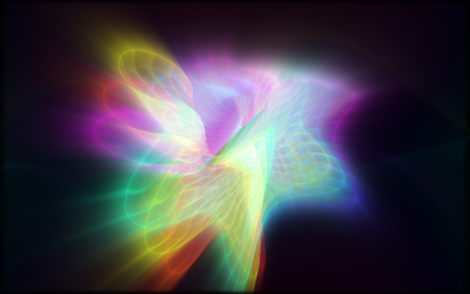

# Newon

A music-driven light synthesizer for macOS, inspired by Jeff Minter and Ivan
Zorzin's **Neon** on the Xbox 360.

[Download Newon for macOS](https://github.com/Jomcabe/NeonVisualizerModern/releases/latest)

Universal DMG for Apple Silicon and Intel. System audio capture requires macOS 13+.



## The 0.4 rebuild

The renderer now centers on textured, moving 3D forms and recursive video feedback.
Eight curated scenes cover interwoven knots, folded flowers, liquid ribbons,
chromatic tunnels, feedback cubes, and nested radial forms. Scenes dissolve over
four seconds. Autopilot changes the composition every 32 seconds, or near a musical
section change after a scene has had time to develop.

The rendering pipeline uses real parametric geometry, previous-frame textures,
time-based feedback, a bloom pass, and a color-preserving output curve. Bass
changes volume and feedback expansion. Mids deform the surface. High frequencies
brighten its detail. The waveform and spectrum also texture the geometry directly.
Camera motion is continuous. There are no random per-hit camera jolts.

This is an independent reconstruction of the visual language, not a port of
Llamasoft's proprietary engine or an exact copy of its presets. See
[the reference notes](docs/neon-reference.md) for the visual targets.

## Use it

1. Open the DMG and drag Newon into Applications.
2. Open Newon. The personal build is ad-hoc signed, without Apple notarization.
   If macOS blocks it, use the approval offered under Privacy & Security.
3. Choose **Listen to system audio**, then grant the macOS permission when asked.
4. Play music in Spotify, Apple Music, a browser, or another app.

If permission changes do not take effect, quit Newon completely and reopen it.
A silence message means no signal is arriving. It does not assume your permission
is broken. Start playback, check the source, and reconnect first.

Other sources:

- **Explore the visuals / Demo:** a silent, generated rhythm. No audio permission.
- **File:** play a local audio file. Files stay on the device. The current limit
  is 250 MB; decoding uses memory proportional to the track's duration.
- **Mic:** explicitly use a microphone. It is never chosen automatically and
  never played back through the speakers.
- **Stop:** release the active source and return to ambient motion.

The tiny display track required for system capture stays alive with the audio.
Newon does not display, store, or transmit it. Audio analysis happens locally.
Spotify track metadata is read through AppleScript. Lyrics use LRCLIB, which
receives the track name, artist, album, and duration to look up the lyrics.

## Controls

Move the pointer to reveal the controls. They disappear after a few seconds.
Open the control panel with **C**. Preferences are remembered on this device.

| Control | Action |
| --- | --- |
| Left / right arrow | Previous / next scene; turns off autopilot |
| Space | Pause / resume visual motion; audio continues |
| R | Change the current form's variation |
| A | Toggle autopilot |
| C | Open / close controls |
| F | Toggle fullscreen |
| Drag | Rotate the camera |
| Double-click / Escape | Recenter the camera |
| Gamepad left stick | Rotate the camera |
| Gamepad right stick | Change hue and variation |
| Gamepad D-pad left/right or LB/RB | Previous / next scene |
| Gamepad A / X / Y | Variation / palette / autopilot |
| Gamepad B / Start | Controls / pause motion |

Brightness, glow, persistence, motion, sensitivity, and color are independent.
Adaptive quality limits pixel count and lowers resolution if rendering stays slow.
High and Low power modes keep a fixed quality budget. Reduced-motion preferences
start with motion paused.

Spotify's current track and synced lyrics appear during system-audio capture.
Other audio sources still animate the visualizer. Lyrics hide on pause,
instrumental gaps, source changes, and track changes.

## Develop

```bash
npm ci
npm start
```

Preview the desktop renderer in a browser:

```bash
npm run dev
```

Open the local address printed by the command. In a browser, system capture is
limited to the audio-sharing options provided by that browser. Use File or Demo
where tab audio is unavailable. Spotify metadata requires the native Mac app.

Run the checks:

```bash
npm test
npm run test:visual
```

The native Electron checks render all eight scenes, reject blank or overexposed
frames, check WebGL errors, save screenshots, and exercise the app's controls.
On a headless Linux machine, run them under Xvfb. For software rendering, set
`NEWON_SOFTWARE_GL=1`. Set `NEWON_TEST_OUTPUT` to choose the screenshots directory.

Build a universal Mac installer on macOS:

```bash
npm run dist
```

GitHub Actions runs the checks before building the DMG. A main-branch push,
version tag, or manual workflow run publishes the version from package.json.
Other branches produce downloadable build artifacts.

## Source map

| File | Purpose |
| --- | --- |
| src/shaders.js | Parametric surfaces, recursive texture sampling, feedback, bloom |
| src/gl.js | WebGL resource management and rendering passes |
| src/presets.js | Eight scenes, palettes, validated settings |
| src/audio.js | Audio sources, seven bands, envelopes, onsets, tempo estimate |
| src/renderer.js | Transitions, input, controls, source lifecycle, lyric timing |
| src/main.js | Electron window, macOS capture, Spotify, lyric requests |
| tests/ | Audio tests and deterministic rendering checks |

No graphics framework or runtime dependency beyond Electron. MIT license.

Neon and Xbox belong to their respective owners. Newon is an independent fan project.
